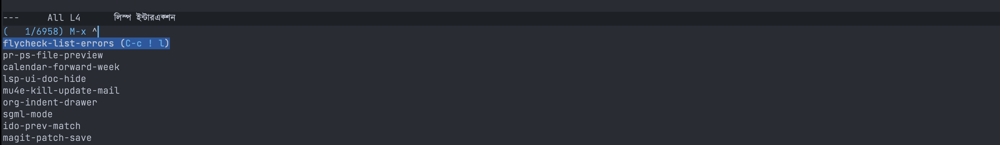
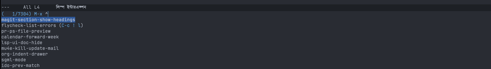
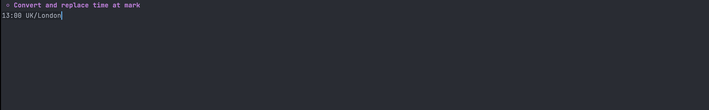

# 🌍 TZC - Time Zone Converter for Emacs

> A powerful time zone conversion tool for Emacs that makes working with multiple time zones effortless.

<div align="center">


[](https://melpa.org/#/tzc)
[](https://www.gnu.org/software/emacs/)

</div>

---

## 📖 Table of Contents

- [About](#about)
- [Installation](#installation)
- [Customization](#customization)
- [How to Use](#how-to-use)
  - [Convert Time Between Zones](#convert-time-between-zones)
  - [Convert to Favorite Time Zones](#convert-to-favorite-time-zones)
  - [Convert and Replace Time](#convert-and-replace-time)
  - [Convert Org Time Stamps](#convert-org-time-stamps)
  - [World Clock](#world-clock)
- [Contributing](#contributing)

---

## 🎯 About

**TZC** is a lightweight yet powerful Emacs tool designed to seamlessly convert times between different time zones. Whether you're coordinating across continents or managing complex scheduling, TZC has you covered.

### Key Features

- ✅ **Full tzdata Support**: Leverages the complete tzdata database (e.g., `America/New_York`) including daylight saving time rules
  - Learn more: [Emacs Time-Zone Rules](https://www.gnu.org/software/emacs/manual/html_node/elisp/Time-Zone-Rules.html)

- ✅ **Custom Offset Support**: Works with time offsets in `±HHMM` format
  - Supports shorthand notation: `±HH`, `±HHM` (e.g., `UTC+0530`, `GM+053`)

- ✅ **Smart Auto-Completion**: Browse all available time zones on your system (macOS/Linux)
  - Can't find your zone? Easily add it to `tzc-favourite-time-zones`

- ✅ **Multiple Conversion Modes**: Handle various use cases from simple conversions to complex timestamp transformations

---

## 📦 Installation

### From MELPA (Recommended)

TZC is available on [MELPA](https://melpa.org/#/tzc). Follow the [MELPA getting started guide](https://melpa.org/#/getting-started) for setup instructions.

#### With `use-package`:

```emacs-lisp
(use-package tzc
  :ensure t)
```

#### Manual Installation:

1. Clone the repository
2. Add to your Emacs config:
```emacs-lisp
(add-to-list 'load-path "/path/to/tzc")
(require 'tzc)
```

---

## ⚙️ Customization

### Configure Your Favorite Time Zones

Customize `tzc-favourite-time-zones-alist` to set your preferred time zones with custom labels:

```emacs-lisp
(setq tzc-favourite-time-zones-alist
      '(("UTC+0000" "UTC")
        ("Asia/Kolkata" "Kolkata")
        ("America/New_York" "New York")
        ("Europe/London" "London")
        ("Europe/Berlin" "Berlin")
        ("Asia/Shanghai" "Shanghai")
        ("Asia/Tokyo" "Tokyo")))
```

---

## 🚀 How to Use

### Convert Time Between Zones

Use the interactive function **`tzc-convert-time`** to quickly convert times from one time zone to another.

<div align="center">
  
</div>

**Usage**: Call `M-x tzc-convert-time`, enter your time, source zone, and target zone

---

### Convert to Favorite Time Zones

Quickly convert a time to all your favorite time zones at once using **`tzc-convert-time-to-favourite-time-zones`**.

<div align="center">
  
</div>

**Setup**: Define your preferences in `tzc-favourite-time-zones-alist` and call `M-x tzc-convert-time-to-favourite-time-zones`

---

### Convert and Replace Time

Seamlessly replace times in your buffer with converted values—perfect for updating timestamps across your documents.

<div align="center">
  
</div>

**Usage**: Position your cursor at the time you want to convert and call `M-x tzc-convert-and-replace-time-at-mark`

---

### Convert Org Time Stamps

Transform Org mode time stamps between different time zones while preserving the Org format.

<div align="center">
  <video width="600" autoplay loop muted>
    <source src="./screenshots/tzc_demo_r.mp4" type="video/mp4">
  </video>
</div>

**Usage**: With your cursor on an Org time stamp, call `M-x tzc-org-timestamp-dispatch`

---

### World Clock

An enhanced world clock view with navigation features. Use **`tzc-world-clock`** to open the world clock buffer.

<div align="center">
  
</div>

**Navigation**:
- Press `n` for next hour
- Press `p` for previous hour  
- Press `g` to return to current time

This view displays time information for all your configured zones, updated as you navigate through hours.

---

## 👨‍💻 Author

**Md Arif Shaikh**  
📧 [arifshaikh.astro@gmail.com](mailto:arifshaikh.astro@gmail.com)

---

## 📜 License

This project is licensed under the GNU General Public License v3 (GPLv3) - see the [LICENSE](LICENSE) file for details.

---

## 🤝 Contributing

Contributions are welcome! Feel free to open issues or submit pull requests to improve TZC.

---

<div align="center">

**Made with ❤️ for the Emacs community**

</div>
